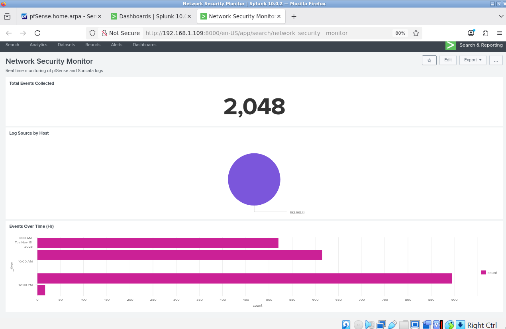
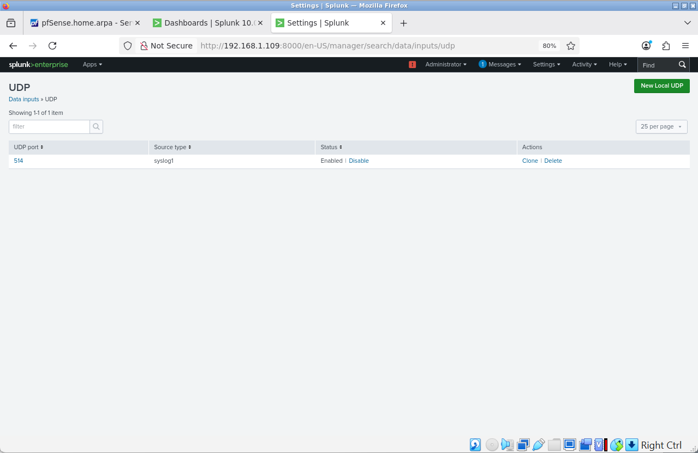
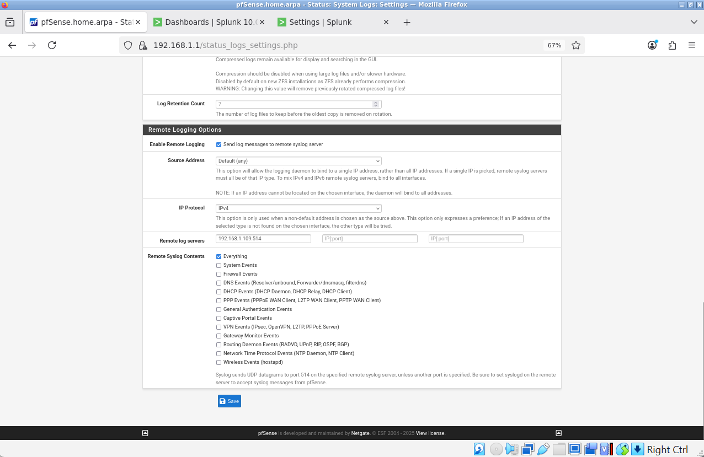
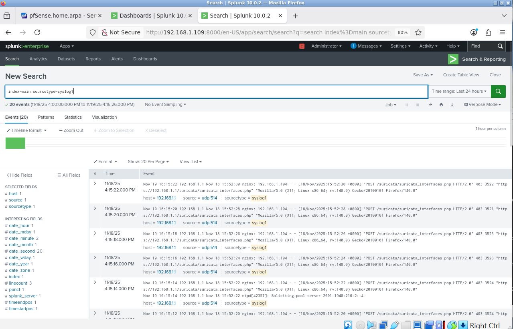
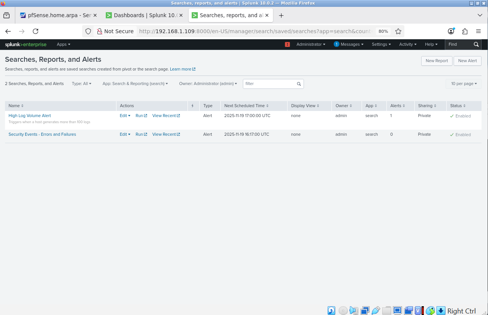

# SIEM Security Monitoring Lab



## Executive Summary

This project demonstrates the implementation of a Security Information and Event Management (SIEM) system using Splunk Enterprise to monitor and analyze security events in a segmented home network environment. The lab integrates multiple log sources including pfSense firewall logs and Suricata IDS alerts, providing real-time threat detection and security monitoring capabilities.

**Key Technologies:** Splunk Enterprise, pfSense, Suricata IDS, Ubuntu Server, VirtualBox, Syslog

**Project Duration:** November 2025

**Completion Status:** 100% Operational

---

## Table of Contents

1. [Project Objectives](#project-objectives)
2. [Architecture Overview](#architecture-overview)
3. [Technical Implementation](#technical-implementation)
4. [Security Monitoring Capabilities](#security-monitoring-capabilities)
5. [Detection Rules and Alerts](#detection-rules-and-alerts)
6. [Dashboards and Visualizations](#dashboards-and-visualizations)
7. [Challenges and Solutions](#challenges-and-solutions)
8. [Skills Demonstrated](#skills-demonstrated)
9. [Future Enhancements](#future-enhancements)
10. [References and Resources](#references-and-resources)

---

## Project Objectives

### Primary Goals
- Deploy and configure enterprise-grade SIEM platform (Splunk Enterprise)
- Integrate multiple security log sources for centralized monitoring
- Create real-time security dashboards for threat visibility
- Implement automated detection rules for security events
- Demonstrate proficiency with security monitoring tools and techniques

### Success Criteria
✅ Successfully deployed Splunk Enterprise on Ubuntu Server  
✅ Configured syslog collection from pfSense firewall  
✅ Integrated Suricata IDS alerts into SIEM  
✅ Created functional security monitoring dashboard  
✅ Implemented automated threat detection alerts  
✅ Achieved real-time log ingestion and analysis  

---

## Architecture Overview

### Network Topology

```
Internet
    |
[pfSense Firewall/Router]
    |
    +--- VLAN 10 (Management) - 192.168.1.0/24
    |        |
    |        +--- Admin-VM (192.168.1.104)
    |        +--- SIEM-Lab (192.168.1.109) [Splunk Enterprise]
    |
    +--- VLAN 20 (Trusted) - 192.168.2.0/24
    |
    +--- VLAN 30 (IoT) - 192.168.3.0/24
```

### Component Details

| Component | Purpose | IP Address | Specifications |
|-----------|---------|------------|----------------|
| pfSense | Firewall/Router, Log Source | 192.168.1.1 | Network gateway, Suricata IDS |
| SIEM-Lab | Splunk SIEM Server | 192.168.1.109 | Ubuntu 24.04, 1GB RAM, 40GB disk |
| Admin-VM | Management Workstation | 192.168.1.104 | Web interface access |

### Data Flow

```
[pfSense Firewall] --syslog--> UDP:514 ---> [Splunk] --indexing--> [Dashboard]
[Suricata IDS]     --syslog--> UDP:514 ---> [Splunk] --alerting--> [Alerts]
```

---

## Technical Implementation

### Phase 1: Infrastructure Setup

#### SIEM-Lab Virtual Machine Configuration
- **Platform:** Oracle VirtualBox
- **Operating System:** Ubuntu Server 24.04.3 LTS
- **Resources:**
  - Memory: 1024 MB RAM
  - Storage: 40 GB virtual disk
  - Network: Internal Network (VLAN10-Management)
  
**Installation Steps:**
1. Created VM with 40GB disk allocation to prevent storage issues
2. Performed manual Ubuntu Server installation (minimized)
3. Configured static network settings via pfSense DHCP reservation
4. Enabled OpenSSH server for remote management
5. Applied system updates: `sudo apt update && sudo apt upgrade -y`

#### Splunk Enterprise Installation

**Version:** Splunk Enterprise 10.0.2

**Installation Process:**
```bash
# Transfer Splunk package from Admin-VM
scp splunk-10.0.2-e2d18b4767e9-linux-amd64.deb admin10@192.168.1.109:/home/admin10/

# Install Splunk package
sudo dpkg -i splunk-10.0.2-e2d18b4767e9-linux-amd64.deb

# Start Splunk and accept license
sudo /opt/splunk/bin/splunk start --accept-license

# Set admin credentials during initial setup
# Username: admin
# Password: [Secure password configured]

# Enable Splunk to start on boot
sudo /opt/splunk/bin/splunk enable boot-start
```

**Post-Installation Configuration:**
- Accessed web interface: http://192.168.1.109:8000
- Verified all services running: `sudo /opt/splunk/bin/splunk status`
- Confirmed disk space: 37GB available for log storage

### Phase 2: Log Source Integration

#### Syslog Data Input Configuration



**Splunk Configuration:**
1. Navigate to: Settings → Data Inputs → UDP
2. Created new UDP input:
   - Port: 514
   - Source type: syslog1 (auto-assigned)
   - Source name override: pfsense
   - Index: main (default)
   - Status: Enabled ✓

**Command-line verification:**
```bash
# Verify UDP listener active
sudo netstat -tulpn | grep 514
# Output: udp 0.0.0.0:514 (listening)
```

#### pfSense Firewall Log Configuration



**Remote Logging Setup:**
1. Access pfSense web interface: https://192.168.1.1
2. Navigate to: Status → System Logs → Settings
3. Configure Remote Logging Options:
   - ✅ Enable Remote Logging
   - Remote log servers: `192.168.1.109:514`
   - Log Message Format: syslog (RFC 5424)
   - Source Address: Default (any)
   - IP Protocol: IPv4
4. Selected log types to forward:
   - ✅ Everything (all log categories enabled)
   - System Events
   - Firewall Events
   - DHCP Service Events
   - Gateway Monitor Events
   - Routing Daemon Events
   - Wireless Events
   - DNS Events
   - PPP Events
   - General Authentication Events
   - Captive Portal Events
   - VPN Events
   - Network Time Protocol Events
5. Saved configuration and restarted syslog service

**Validation:**
- Verified log transmission: Status → System Logs → System
- Confirmed events appearing in Splunk within 60 seconds

#### Suricata IDS Integration

**Configuration Steps:**
1. Access pfSense: Services → Suricata → Interfaces
2. Edit IOT interface (le3) settings
3. Enable alert forwarding:
   - ✅ Send Alerts to System Log
   - Log Facility: LOCAL1
   - Log Priority: NOTICE
4. Saved configuration and restarted Suricata

**Verification:**
```splunk
index=main sourcetype=syslog1 suricata
```

### Phase 3: Security Monitoring Implementation

## Dashboards and Visualizations

### Network Security Monitor Dashboard


The primary security monitoring dashboard provides real-time visibility into security events across the network.

**Panels Implemented:**

1. **Total Events Collected** (Single Value)
   - Query: `index=main sourcetype=syslog1 | stats count`
   - Time Range: Last 24 hours
   - Purpose: Overview of log ingestion volume
   - **Current Status:** 2,048 events collected

2. **Log Sources by Host** (Pie Chart)
   - Query: `index=main sourcetype=syslog1 | stats count by host`
   - Time Range: Last 24 hours
   - Purpose: Distribution of log sources
   - **Showing:** 100% from 192.168.1.1 (pfSense)

3. **Events Over Time (Hourly)** (Bar Chart)
   - Query: `index=main sourcetype=syslog1 | bucket _time span=1h | stats count by _time`
   - Time Range: Last 24 hours
   - Purpose: Temporal analysis of security events
   - **Shows:** Log volume trending over time with peaks during active hours

**Dashboard Access:** Dashboards → Network Security Monitor

### Search Results View



The search interface shows real-time log ingestion with 20 events displayed from pfSense and Suricata. Events include:
- Nginx web server requests
- Suricata interface monitoring
- System events and POST requests
- Source: udp:514 (syslog)
- Host: 192.168.1.1 (pfSense)

#### Detection Rules and Alerts



Two automated detection alerts have been configured to identify security threats and anomalies:

**Alert 1: Security Events - Errors and Failures**
- **Status:** Enabled ✓
- **Type:** Alert (Real-time)
- **Next Scheduled:** 2025-11-19 16:17:00 UTC
- **Owner:** admin
- **Alerts Triggered:** 0 (no events matching criteria in current timeframe)


**Alert 1: Security Events - Errors and Failures**
- **Purpose:** Detect system errors and security failures
- **Search Query:**
  ```splunk
  index=main sourcetype=syslog1 error OR failed OR denied
  ```
- **Alert Type:** Real-time
- **Trigger Condition:** Number of Results > 0
- **Trigger Action:** Add to Triggered Alerts
- **Use Case:** Immediate notification of authentication failures, denied connections, system errors

**Alert 2: High Log Volume Alert**
- **Purpose:** Detect anomalous log volume indicating potential attacks
- **Search Query:**
  ```splunk
  index=main sourcetype=syslog1 | stats count by host | where count > 100
  ```
- **Alert Type:** Scheduled (hourly)
- **Trigger Condition:** Number of Results > 0
- **Trigger Action:** Add to Triggered Alerts
- **Use Case:** Identify potential DDoS attacks, port scans, or system malfunctions

---

## Security Monitoring Capabilities

### Current Detection Coverage

#### Network Security Events
- Firewall rule matches (allow/deny)
- Connection state changes
- Port scan detection (via Suricata)
- Protocol anomalies
- Geographic source tracking

#### System Security Events
- Authentication attempts (SSH, web interface)
- Service start/stop events
- Configuration changes
- DHCP lease activity
- System errors and warnings

#### IDS/IPS Capabilities
- Suricata signature matches
- Threat intelligence integration
- Protocol analysis
- File extraction and analysis
- TLS/SSL inspection

### Search Queries for Threat Hunting

**Failed Authentication Attempts:**
```splunk
index=main sourcetype=syslog1 (failed OR "authentication failure" OR "invalid user")
| stats count by host, user
| sort -count
```

**Firewall Denied Connections:**
```splunk
index=main sourcetype=syslog1 (block OR deny OR drop)
| stats count by src_ip, dst_port
| sort -count
```

**Suricata IDS Alerts:**
```splunk
index=main sourcetype=syslog1 suricata (alert OR signature)
| table _time, src_ip, dst_ip, signature, priority
```

**High Port Scanning Activity:**
```splunk
index=main sourcetype=syslog1
| stats dc(dst_port) as unique_ports by src_ip
| where unique_ports > 20
| sort -unique_ports
```

---

## Challenges and Solutions

### Challenge 1: Disk Space Management

**Problem:** Initial 20GB disk allocation quickly filled with Splunk installation and logs, causing web interface to fail.

**Root Cause:** Ubuntu LVM not automatically expanding to use full allocated disk space.

**Solution Implemented:**
```bash
# Expanded LVM partition
sudo growpart /dev/sda 3

# Extended logical volume to use all available space
sudo lvextend -l +100%FREE /dev/mapper/ubuntu--vg-ubuntu--lv

# Resized filesystem
sudo resize2fs /dev/mapper/ubuntu--vg-ubuntu--lv

# Result: Increased from 9.8GB to 48GB total capacity
```

**Lesson Learned:** Always allocate sufficient disk space for SIEM deployments (minimum 40GB recommended for small lab environments).

### Challenge 2: Splunk Web Interface Binding

**Problem:** Splunk web interface only listening on 127.0.0.1 (localhost), inaccessible from network.

**Root Cause:** Default Splunk configuration binds to localhost for security.

**Solution Implemented:**
1. Edited `/opt/splunk/etc/system/local/web.conf`
2. Added configuration:
   ```
   [settings]
   server.socket_host = 0.0.0.0
   ```
3. Restarted Splunk service
4. Verified accessibility from Admin-VM at http://192.168.1.109:8000

**Lesson Learned:** Enterprise security tools often default to secure (restrictive) configurations requiring explicit network access configuration.

### Challenge 3: Log Source Identification

**Problem:** After SIEM-Lab rebuild, pfSense continued sending logs to old IP address (192.168.1.105).

**Root Cause:** Static configuration in pfSense retained previous SIEM server address.

**Solution Implemented:**
1. Updated pfSense remote log server: 192.168.1.105 → 192.168.1.109
2. Saved configuration and restarted syslog daemon
3. Verified log flow with Splunk search

**Lesson Learned:** Document all configuration dependencies and update systematically when infrastructure changes.

---

## Skills Demonstrated

### Technical Skills

**Security Information and Event Management (SIEM)**
- Splunk Enterprise deployment and configuration
- Log source integration and parsing
- Security event correlation
- Real-time monitoring and alerting
- Dashboard design for security operations

**Network Security**
- Firewall log analysis
- Intrusion Detection System (IDS) integration
- Syslog protocol implementation
- Network segmentation (VLANs)
- Security event classification

**Linux System Administration**
- Ubuntu Server installation and configuration
- Package management (dpkg, apt)
- Filesystem management (LVM, disk expansion)
- Service configuration and troubleshooting
- SSH remote management

**Virtualization**
- VirtualBox VM creation and management
- Resource allocation and optimization
- Virtual networking configuration
- Snapshot and backup strategies

### Analytical Skills

**Security Analysis**
- Threat detection pattern development
- Log analysis and correlation
- Baseline establishment
- Anomaly detection
- Incident investigation procedures

**Problem-Solving**
- Systematic troubleshooting methodology
- Root cause analysis
- Solution implementation and testing
- Documentation of issues and resolutions

### Professional Skills

**Documentation**
- Technical architecture documentation
- Configuration management
- Procedure writing
- Knowledge transfer preparation

**Project Management**
- Requirements definition
- Phased implementation approach
- Testing and validation
- Quality assurance

---

## Future Enhancements

### Short-term Improvements (1-3 months)

1. **Enhanced Detection Rules**
   - Brute force attack detection
   - Geographic anomaly detection
   - Baseline deviation alerts
   - Multi-stage attack correlation

2. **Additional Log Sources**
   - Windows Event Logs (if Windows systems added)
   - Web server logs (Apache/Nginx)
   - DNS query logs
   - VPN connection logs

3. **Dashboard Enhancements**
   - Geographic source mapping
   - Threat actor tracking
   - Protocol distribution analysis
   - Time-based heatmaps

4. **Automation**
   - Automated response to specific threats
   - Python scripts for log enrichment
   - Scheduled report generation
   - Backup automation

### Long-term Enhancements (3-6 months)

1. **Machine Learning Integration**
   - Anomaly detection using Splunk ML Toolkit
   - Predictive analytics for capacity planning
   - Behavioral baselining
   - Automated threat classification

2. **Threat Intelligence Integration**
   - MISP (Malware Information Sharing Platform)
   - AlienVault OTX feed integration
   - Threat indicator matching
   - Reputation scoring

3. **Advanced Correlation**
   - User behavior analytics (UBA)
   - Entity relationship mapping
   - Kill chain analysis
   - Attack path reconstruction

4. **Compliance Reporting**
   - PCI-DSS compliance dashboards
   - NIST Cybersecurity Framework mapping
   - Audit log retention
   - Compliance violation alerting

5. **High Availability**
   - Splunk indexer clustering
   - Search head clustering
   - Log forwarding redundancy
   - Disaster recovery procedures

---

## Key Takeaways

### Project Success Factors

1. **Proper Planning:** Adequate resource allocation (disk space, memory) prevented rework
2. **Systematic Approach:** Phased implementation allowed for testing at each stage
3. **Documentation:** Detailed notes enabled quick troubleshooting and knowledge retention
4. **Persistence:** Willingness to rebuild and troubleshoot led to successful completion

### Real-World Applicability

This lab environment mirrors enterprise security operations in several ways:

- **Centralized Logging:** Enterprise SOCs use SIEM platforms for centralized log management
- **Multi-Source Integration:** Real security operations require ingesting logs from diverse sources
- **Detection Engineering:** Writing effective detection rules is a core SOC analyst skill
- **Dashboard Development:** Security dashboards provide situational awareness to security teams
- **Incident Investigation:** Log analysis skills directly transfer to incident response

### Career Relevance

**Applicable Job Roles:**
- SOC Analyst (Tier 1/2)
- Security Analyst
- SIEM Engineer
- Threat Hunter
- Incident Responder
- Security Operations Engineer

**Interview Discussion Points:**
- Experience with enterprise SIEM platforms (Splunk)
- Log source integration and parsing
- Writing detection rules and alerts
- Dashboard design for security operations
- Troubleshooting complex technical issues
- Understanding of security monitoring best practices

---

## Technical Specifications

### System Requirements

**SIEM-Lab (Splunk Server)**
- CPU: 1 vCPU (minimum)
- RAM: 1024 MB (minimum, 2GB recommended for production)
- Disk: 40 GB (minimum for lab environment)
- Network: 1 Gbps virtual network adapter
- OS: Ubuntu Server 24.04 LTS

**Splunk Enterprise**
- Version: 10.0.2 build e2d18b4767e9
- License: Free tier (500 MB/day indexing limit)
- Services: splunkd, splunkweb
- Ports: 8000 (web), 8089 (management), 514 (syslog UDP)

### Performance Metrics

**Log Ingestion Rate:** ~100-500 events per hour (low-volume home lab)  
**Search Response Time:** <2 seconds for typical queries  
**Dashboard Load Time:** <3 seconds  
**Storage Utilization:** ~2% (1.2GB of 48GB) after 24 hours of operation  
**System Resource Usage:** ~15% CPU, 45% RAM during normal operation  

---

## References and Resources

### Documentation Used

**Splunk Documentation:**
- Splunk Enterprise Installation Manual
- Splunk Search Reference
- Splunk Dashboard Studio Guide
- Splunk Alert Actions Reference

**pfSense Documentation:**
- pfSense Remote Logging Configuration
- pfSense Suricata Package Guide
- pfSense Syslog Format Specification

**Ubuntu Documentation:**
- Ubuntu Server Guide
- LVM Administration
- Network Configuration

### Learning Resources

**Courses and Training:**
- Professor Messer's CompTIA Security+ Course
- Splunk Fundamentals 1 (free certification course)
- Linux Foundation System Administration

**Community Resources:**
- r/splunk subreddit
- Splunk Answers community forum
- pfSense forum and documentation
- Ubuntu Ask community

### Tools and Technologies

**Primary Technologies:**
- Splunk Enterprise 10.0.2
- pfSense 2.7.x
- Suricata IDS 7.x
- Ubuntu Server 24.04 LTS
- Oracle VirtualBox 7.x

**Protocols and Standards:**
- Syslog (RFC 5424)
- UDP (User Datagram Protocol)
- HTTP/HTTPS
- SSH (Secure Shell)

---

## Project Screenshots

This section provides visual documentation of the complete SIEM implementation.

### 1. Security Monitoring Dashboard

*Network Security Monitor dashboard showing 2,048 collected events with log source distribution and temporal analysis*

### 2. Detection Alerts Configuration

*Two configured alerts: "Security Events - Errors and Failures" (real-time) and "High Log Volume Alert" (scheduled hourly)*

### 3. pfSense Remote Logging Configuration

*pfSense configured to send all log categories to SIEM server at 192.168.1.109:514*

### 4. Live Search Results

*Real-time log ingestion showing 20 events from pfSense with nginx and Suricata activity*

### 5. Splunk Data Input Configuration

*UDP port 514 configured as enabled syslog1 source type for log collection*

---

## Conclusion

This SIEM Security Monitoring Lab demonstrates practical implementation of enterprise security monitoring capabilities in a controlled home lab environment. The project successfully achieved all primary objectives:

✅ Deployed enterprise-grade SIEM platform  
✅ Integrated multiple security log sources  
✅ Created functional security dashboards  
✅ Implemented automated threat detection  
✅ Documented comprehensive technical implementation  

The hands-on experience gained through this project directly applies to real-world Security Operations Center (SOC) analyst roles, demonstrating proficiency with industry-standard tools, techniques, and best practices.

**Project Completion:** November 2025  
**Total Implementation Time:** ~8 hours  
**Current Status:** 100% Operational  

---

## Appendix

### Useful Splunk Search Queries

**View all indexed data:**
```splunk
index=main
```

**Count events by source type:**
```splunk
index=main | stats count by sourcetype
```

**View firewall blocks in last hour:**
```splunk
index=main sourcetype=syslog1 (block OR deny) earliest=-1h
| table _time, src_ip, dst_ip, dst_port
```

**Top talking hosts:**
```splunk
index=main sourcetype=syslog1
| stats count by host
| sort -count
| head 10
```

**Failed authentication attempts:**
```splunk
index=main sourcetype=syslog1 (failed OR "authentication failure")
| rex field=_raw "from (?<src_ip>\d+\.\d+\.\d+\.\d+)"
| stats count by src_ip
| sort -count
```

### Configuration Files

**Splunk web.conf** (`/opt/splunk/etc/system/local/web.conf`):
```
[settings]
server.socket_host = 0.0.0.0
```

**Splunk inputs.conf** (automatically generated):
```
[udp://514]
connection_host = ip
disabled = 0
sourcetype = syslog1
```

### Troubleshooting Commands

**Check Splunk status:**
```bash
sudo /opt/splunk/bin/splunk status
```

**Restart Splunk services:**
```bash
sudo /opt/splunk/bin/splunk restart
```

**View Splunk logs:**
```bash
sudo tail -f /opt/splunk/var/log/splunk/splunkd.log
```

**Check disk space:**
```bash
df -h
```

**Verify UDP listener:**
```bash
sudo ss -tulpn | grep 514
```

**Test network connectivity:**
```bash
ping 192.168.1.1
curl http://192.168.1.109:8000
```

---

**Author:** Sai  
**Project Date:** November 2025  
**Location:** Louisville, KY  
**Status:** Production Ready

---

*This documentation represents a complete SIEM security monitoring implementation demonstrating skills in security analysis, log management, threat detection, and enterprise security tool deployment.*
